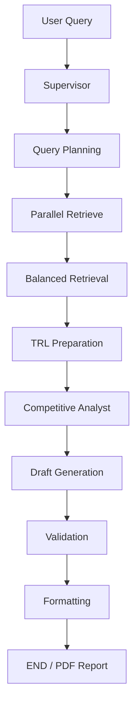

# Subject
Semiconductor R&D Intelligence Agent

## Overview
- Objective : 경쟁사 반도체 R&D 동향을 자동 수집/분석해 전략 보고서(PDF)를 생성
- Method : LangGraph 기반 멀티 에이전트 파이프라인 (Web + RAG -> 균형화 -> TRL/위협 분석 -> 보고서 생성)
- Tools : Tavily, ChromaDB, FAISS Eval, LangSmith

## Features
- PDF/MD/TXT 내부 자료 적재 및 메타데이터 파싱 (`ingest.py`, `document_metadata.py`)
- Tavily 웹 검색 + Chroma RAG 병렬 수집
- 중복 제거, 기간(scope) 필터, 신뢰도 필터, MMR 기반 다양성 확보
- TRL 시그널(논문/특허/뉴스/채용) 집계 및 경쟁 위협도 분석
- Markdown 보고서 생성 후 스타일 렌더링 PDF 출력
- 확증 편향 방지 전략 : 기업/기술/이슈 쿼리 혼합 + web/rag 병행 + 다중 근거(정량/정성) 검증

## Tech Stack

| Category   | Details |
|------------|---------|
| Framework  | LangGraph, LangChain, Python |
| LLM        | GPT-4o, GPT-4o-mini via OpenAI API |
| Retrieval  | ChromaDB(Vector DB), Tavily(Web), FAISS Eval(Hit@K, MRR) |
| Embedding  | BAAI/bge-m3 (기본), multilingual-e5-large (대안) |
| Observability | LangSmith |
| Output     | Markdown -> HTML -> PDF (WeasyPrint) |

> 최근 FAISS 소규모 평가 예시: `Hit@5=1.000`, `MRR=1.000` (4개 테스트 쿼리)

## Agents

- Supervisor Agent: 전체 워크플로우 라우팅/재시도 제어
- Query Planning Agent: web/rag 혼합 쿼리 생성
- Parallel Retrieve Node: Tavily 검색 + Chroma 검색 병렬 실행
- Balanced Retrieval Node: 중복/필터/MMR 재정렬
- TRL Preparation Node: 시그널 집계
- Competitive Analyst Agent: TRL, 위협도, 핵심 인사이트 분석
- Draft Generation Agent: 전략 보고서 초안 생성
- Validation Node: 구조/정량/근거 기준 자동 검증
- Formatting Node: 최종 보고서 및 REFERENCE 보강

## Architecture



## Directory Structure

```text
├── agents.py                  # 에이전트/노드 구현
├── graph.py                   # LangGraph 정의
├── main.py                    # 실행 엔트리 (PDF 출력)
├── ingest.py                  # 내부 문서 적재
├── document_metadata.py       # 파일명 기반 메타 파싱
├── retrieval_utils.py         # 필터/MMR 유틸
├── state.py                   # 상태 스키마
├── langsmith_setup.py         # LangSmith 초기화
├── eval/
│   ├── retrieval_eval.py      # Chroma 소규모 Hit@K/MRR
│   └── faiss_retrieval_eval.py# FAISS Hit@K/MRR
├── reports/                   # 생성 보고서 (md/pdf)
├── docs/
│   └── corpus.md              # 코퍼스 매핑
├── requirements.txt
└── .env.example
```

## Quick Start

```bash
python3.11 -m venv .venv
source .venv/bin/activate
pip install -r requirements.txt
cp .env.example .env

# 내부 자료 적재
python ingest.py --dir docs/pdfs

# 보고서 생성 (PDF)
python main.py
```

## Contributors
배세은 : Prompt Engineering 및 LLM Agent 아키텍처 설계, 외부 API 연동을 통한 응답 생성 파이프라인 구축
인유진 : PDF Parsing 및 데이터 전처리 파이프라인 구축, FAISS 기반 Retrieval Agent 구현 및 데이터 수집